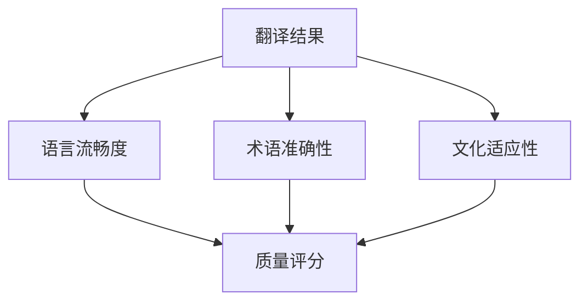

# 实时字幕翻译核心算法详解

## 说话人分离技术
```python
class SpeakerDiarization:
    def __init__(self):
        self.voice_profiles = {}  # 声纹特征库
        self.speaker_count = 0
        
    def process_audio(self, audio_chunk):
        # 使用x-vector进行说话人识别
        features = extract_xvector(audio_chunk)
        speaker_id = self.match_profile(features)
        if speaker_id is None:
            speaker_id = self.register_new_speaker(features)
        return speaker_id
```

## 术语模糊匹配算法
```python
def fuzzy_match_term(text, glossary):
    # 使用改进的Levenshtein距离
    best_match = None
    min_distance = float('inf')
    for term in glossary:
        distance = levenshtein(text, term, 
                            substitution_cost=0.8,
                            transposition_cost=1.2)
        if distance < min_distance:
            min_distance = distance
            best_match = term
    return best_match if min_distance < 3 else None
```

## 翻译质量评估模型


## 实时处理流水线优化
1. **零拷贝音频传输**：
   - 共享内存环形缓冲区
   - 内存映射文件支持
   
2. **批处理优化**：
   - 动态批处理大小调整
   - 优先级队列管理

3. **GPU加速**：
   - CUDA内核优化
   - 混合精度计算
   - 流水线并行