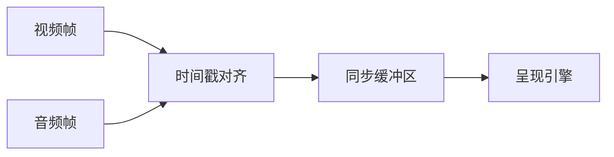

# 实时字幕翻译系统架构深度解析

## 音视频同步机制


## 边缘计算架构
```python
class EdgeDeployment:
    def __init__(self):
        self.edge_nodes = []  # 边缘节点列表
        self.model_partition = {
            'edge': ['vad', 'asr'],
            'cloud': ['translation', 'tts']
        }
    
    def dispatch_task(self, input_data):
        # 智能任务分发逻辑
        pass
```

## 灾备方案设计
1. **热备模式**：
   - 主从服务实时同步
   - 故障检测时间 <200ms
   - 自动切换恢复

2. **数据持久化**：
   - 每5分钟检查点
   - 增量状态保存
   - 断点续传支持