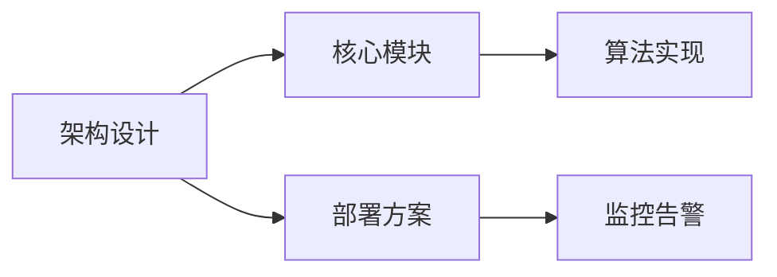

# 文档贡献指南

## 写作规范
1. **格式要求**：
   - 标题采用ATX风格（##）
   - 代码块标注语言类型
   - 表格使用对齐格式

2. **内容准则**：
   ```markdown
   <!-- Good Example -->
   ## 模块设计
   - 使用动词开头说明功能
   - 保持段落简洁（3-5行）
   ```

## 提交流程
1. 创建特性分支：
   ```bash
   git checkout -b docs/feature-name
   ```

2. 提交变更：
   ```bash
   git commit -m "docs: add architecture details"
   ```

3. 发起Pull Request：
   - 关联相关Issue
   - 通过CI检查
   - 等待Review

## 文档结构


## 反馈渠道
- 提交Issue报告问题
- 加入Slack讨论组
- 参与文档评审会