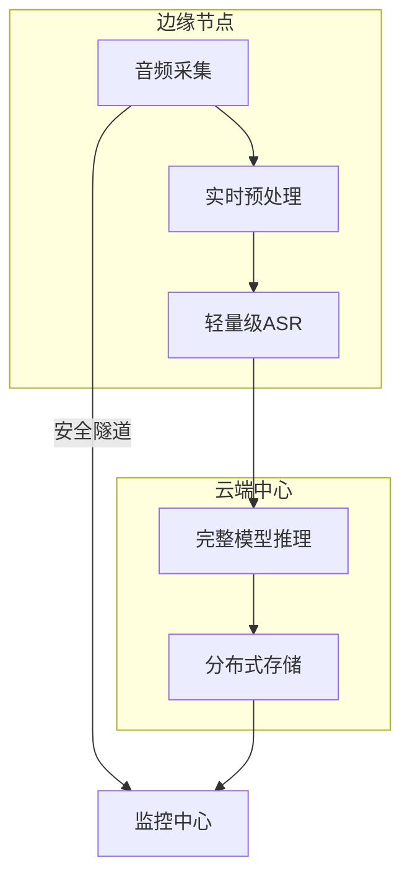

# 高级部署策略与技术方案

## 混合云部署架构


## 自动扩缩容算法
```python
class AutoScaler:
    def __init__(self):
        self.metrics_window = deque(maxlen=10)
        self.current_replicas = 1
        
    def evaluate(self):
        # 基于加权QoS指标决策
        score = 0.6*latency + 0.3*cpu + 0.1*memory
        if score > self.up_threshold:
            self.scale_out()
        elif score < self.down_threshold:
            self.scale_in()
            
    def scale_out(self):
        new_replicas = min(
            self.current_replicas * 2, 
            self.max_replicas)
        # 预热新实例
        self.warm_up(new_replicas)
        
    def scale_in(self):
        # 优雅终止实例
        self.drain_nodes()
```

## 蓝绿部署流程
1. **准备阶段**：
   - 部署新版本到隔离环境
   - 数据同步和配置检查

2. **切换阶段**：
   ```bash
   # 流量逐步迁移
   for i in {1..5}; do
     kubectl set selector svc/translator version=new-$i%
     sleep 30
   done
   ```

3. **回滚机制**：
   - 自动健康检查
   - 一键回滚脚本
   - 状态同步保障

## 混沌工程测试方案
| 测试类型 | 注入方式 | 预期行为 |
|---------|---------|---------|
| 网络延迟 | TC命令 | 自动启用降级模式 |
| 服务中断 | Kill Pod | 30秒内自动恢复 |
| CPU过载 | Stress工具 | 触发自动扩容 |
| 内存泄漏 | 压力测试 | 告警并重启服务 |

## 安全传输方案
```go
type SecureTransport struct {
    certPool   *x509.CertPool
    sessionKey [32]byte
}

func (s *SecureTransport) Encrypt(data []byte) []byte {
    block, _ := aes.NewCipher(s.sessionKey[:])
    gcm, _ := cipher.NewGCM(block)
    nonce := make([]byte, gcm.NonceSize())
    return gcm.Seal(nonce, nonce, data, nil)
}
```