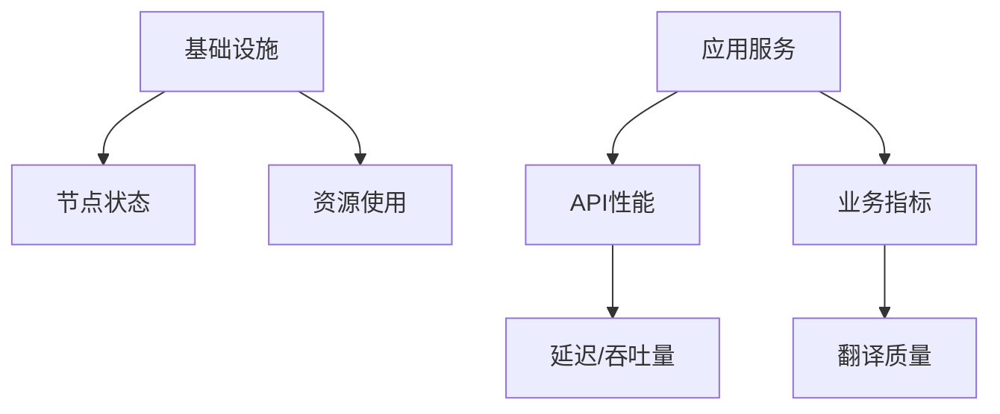

# 监控与文档工程化方案

## 监控指标体系设计


## 多级告警机制
```python
class AlertManager:
    def __init__(self):
        self.levels = {
            'notice': {'interval': 30},
            'warning': {'interval': 10},
            'critical': {'interval': 1}
        }
        
    def evaluate(self, metric):
        if metric > self.critical_threshold:
            self.trigger('critical')
        elif metric > self.warning_threshold:
            self.trigger('warning')
        else:
            self.trigger('notice')

    def trigger(self, level):
        # 根据级别发送通知
        notify(level, self.levels[level])
```

## 自动化文档生成
```bash
# 文档生成流水线
npm run docs:build && \
aws s3 sync ./dist s3://docs-bucket --delete && \
aws cloudfront create-invalidation --paths "/*"
```

## 多语言文档支持
```yaml
i18n:
  locales: [en, zh, ja, ko]
  path: /docs/{locale}/
  default_locale: en
  plugins:
    - name: search
      options:
        translations:
          search_placeholder:
            en: Search
            zh: 搜索
            ja: 検索
            ko: 검색
```

## 运维自动化脚本
```python
def health_check():
    services = ['api', 'model', 'db']
    for svc in services:
        if not check_health(svc):
            restart_service(svc)
            if not check_health(svc):
                failover_to_backup(svc)

def log_analyze():
    errors = grep_logs('ERROR')
    for err in errors:
        if 'OOM' in err:
            scale_up_memory()
        elif 'Timeout' in err:
            adjust_timeout()
```

## 用户文档结构
```
docs/
├── getting-started/    # 快速入门
│   ├── install.md
│   └── basic-usage.md
├── guides/             # 使用指南
│   ├── academic.md
│   ├── education.md
│   └── entertainment.md
└── troubleshooting/    # 故障排查
    ├── audio.md
    ├── translation.md
    └── performance.md
```

## 配置管理规范
```ini
[model]
cache_size = 512MB
max_workers = 4

[api]
rate_limit = 100/分钟
timeout = 30s

[logging]
level = INFO
rotation = 100MB
```

## 变更管理流程
1. **文档更新**：
   - 创建特性分支
   - 提交Pull Request
   - 通过CI验证
   - 合并到主分支

2. **版本发布**：
   ```mermaid
   graph LR
       A[代码冻结] --> B[回归测试]
       B --> C[生成文档]
       C --> D[发布公告]
       D --> E[版本归档]
   ```