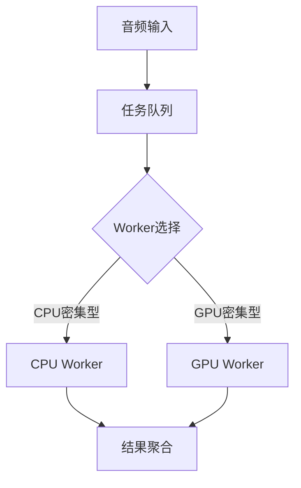

# 系统性能优化专项

## GPU显存优化策略
```python
class GPUMemoryManager:
    def __init__(self):
        self.pool = {}
        self.lock = threading.Lock()
        
    def alloc(self, size):
        with self.lock:
            if size in self.pool and self.pool[size]:
                return self.pool[size].pop()
            return cuda.mem_alloc(size)
            
    def free(self, ptr, size):
        with self.lock:
            if size not in self.pool:
                self.pool[size] = []
            self.pool[size].append(ptr)
```

## 多线程任务调度


## 内存池实现
```cpp
class AudioBufferPool {
public:
    AudioBuffer* acquire(int duration_ms) {
        std::lock_guard<std::mutex> lock(mutex_);
        auto it = pools_[duration_ms].begin();
        if (it != pools_[duration_ms].end()) {
            auto buffer = *it;
            pools_[duration_ms].erase(it);
            return buffer;
        }
        return new AudioBuffer(duration_ms);
    }
    
    void release(AudioBuffer* buffer) {
        std::lock_guard<std::mutex> lock(mutex_);
        pools_[buffer->duration_ms()].insert(buffer);
    }
private:
    std::map<int, std::unordered_set<AudioBuffer*>> pools_;
    std::mutex mutex_;
};
```

## 实时性保障方案
1. **优先级调度**：
   - 音频采集线程：实时优先级
   - 识别线程：高优先级
   - 翻译线程：普通优先级

2. **资源预留**：
   - GPU计算单元预留20%
   - 内存预留1GB
   - 网络带宽预留10Mbps

3. **降级策略**：
   ```yaml
   degradation:
     levels:
       - trigger: cpu > 80%
         action: disable_vad
       - trigger: latency > 2s
         action: skip_post_edit
       - trigger: memory > 90%
         action: release_cache
   ```