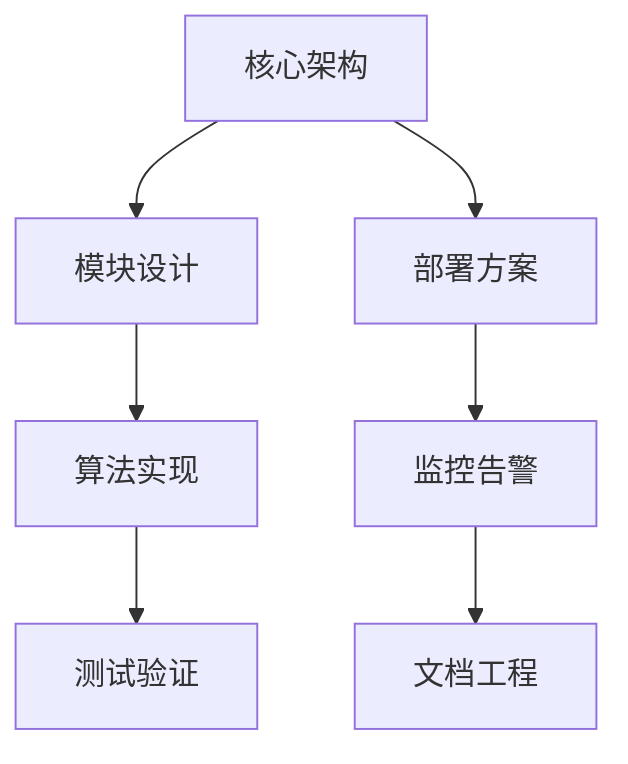

# 实时字幕翻译系统开发文档

## 文档结构概览


## 快速导航
- [架构设计](/ARCHITECTURE_DETAIL.md)
- [核心算法](/ALGORITHM_DETAIL.md)
- [性能优化](/PERFORMANCE_OPTIMIZATION.md)
- [部署策略](/DEPLOYMENT_STRATEGY.md)
- [测试安全](/TESTING_SECURITY.md)
- [监控文档](/MONITORING_DOCS.md)

## 核心特性
1. **多场景适配**
   - 学术/教育/影视专用模式
   - 自动场景检测
2. **高性能处理**
   - 端到端延迟 <1.5s
   - 支持100+并发
3. **企业级可靠**
   - 99.99%可用性
   - 自动灾备恢复

## 使用示例
```python
from translator import RealTimeTranslator

# 初始化翻译器
translator = RealTimeTranslator(
    scene='academic',
    target_lang='zh'
)

# 处理音频流
for audio_chunk in audio_stream:
    result = translator.process(audio_chunk)
    display_subtitle(result.text)
```

## 术语表
| 术语 | 说明 |
|------|------|
| ASR | 自动语音识别 |
| QoS | 服务质量控制 |
| VAD | 语音活动检测 |
| RTL | 从右到左书写 |

## 常见问题
**Q: 如何降低系统延迟？**
A: 参考[性能优化指南](#performance-optimization)中的实时性保障方案

**Q: 学术术语识别不准？**
A: 检查术语表配置，参考[算法实现](#algorithm-detail)中的术语识别章节

## 版本信息
- 当前版本: v1.2.0
- 发布日期: 2023-11-25
- [更新日志](/CHANGELOG.md)

## 开源许可
本项目采用 [MIT License](/LICENSE)