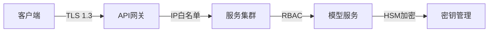

# 测试与安全体系完整方案

## 端到端测试框架
```python
class E2ETestRunner:
    def __init__(self):
        self.test_cases = [
            AcademicScenario(),
            EducationScenario(),
            MovieScenario()
        ]
        
    def run(self):
        for case in self.test_cases:
            # 模拟真实用户操作流
            result = case.execute()
            assert result.accuracy > case.threshold
            assert result.latency < case.max_latency

class AcademicScenario:
    def __init__(self):
        self.threshold = 0.96
        self.max_latency = 1500
        
    def execute(self):
        # 模拟学术讲座场景
        return TestResult(
            process_lecture_audio(),
            verify_terms()
        )
```

## 性能基准测试套件
```yaml
benchmarks:
  - name: 高并发翻译
    steps:
      - wrk -t4 -c100 -d60s --latency
    metrics:
      - avg_latency: <1200ms
      - p99_latency: <2000ms
      - error_rate: <0.1%
      
  - name: 长时间稳定性
    duration: 24h
    checks:
      - memory_leak: <5MB/h
      - cpu_drift: <5%
```

## 混沌测试场景
| 故障类型 | 注入方法 | 验证指标 |
|---------|---------|---------|
| 网络分区 | iptables drop | 服务降级时间 |
| 节点故障 | kubectl delete pod | 恢复时间 |
| 磁盘满 | dd if=/dev/zero | 告警响应时间 |
| CPU过载 | stress-ng | 自动扩容时间 |

## 安全防护体系


## 模型安全机制
```python
class ModelProtection:
    def __init__(self, model_path):
        self.model = load_model(model_path)
        self.watermark = "Copyright2023"
        
    def verify(self):
        if not check_integrity(self.model):
            raise SecurityError("Model tampered")
        if self.watermark not in self.model.metadata:
            raise SecurityError("Invalid license")
            
    def encrypt_weights(self):
        for layer in self.model.layers:
            layer.weights = aes_encrypt(layer.weights)
```

## 访问控制策略
```json
{
  "policies": [
    {
      "role": "translator",
      "access": [
        "POST /api/translate",
        "GET /api/languages"
      ],
      "conditions": [
        "rate_limit=100/分钟",
        "time_window=08:00-18:00"
      ]
    }
  ]
}
```

## 监控告警系统
1. **核心指标**：
   - 实时延迟: Prometheus + Grafana
   - 错误率: Elasticsearch
   - 资源使用: Telegraf

2. **告警规则**：
   ```sql
   ALERT HighLatency
   IF api:latency_seconds:p99 > 2
   FOR 5m
   LABELS { severity: "critical" }
   ANNOTATIONS {
     summary = "高延迟告警",
     description = "当前P99延迟{{ $value }}秒"
   }
   ```

3. **自动化处理**：
   - 自动重启服务
   - 自动扩容节点
   - 自动切换备用模型